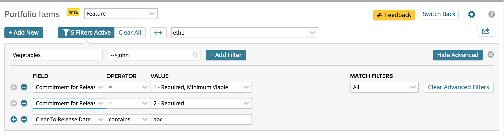

ViewFinder
=========================

## Overview

This app allows for the display of the fields and values used in "advanced" views.  Might be useful for admins who want to change fields and know which public views are affected.  (Only returns views that are public or belong to the person running the app.)

For example, if you have a Portfolio Items page view with this definition for a view called "Ethel":

Then you can see in the grid above that there are a series of fields used by ethel.

## License

Random App Name99116 is released under the MIT license.  See the file [LICENSE](./LICENSE) for the full text.

##Documentation for SDK

You can find the documentation on our help [site.](https://help.rallydev.com/apps/2.1/doc/)
